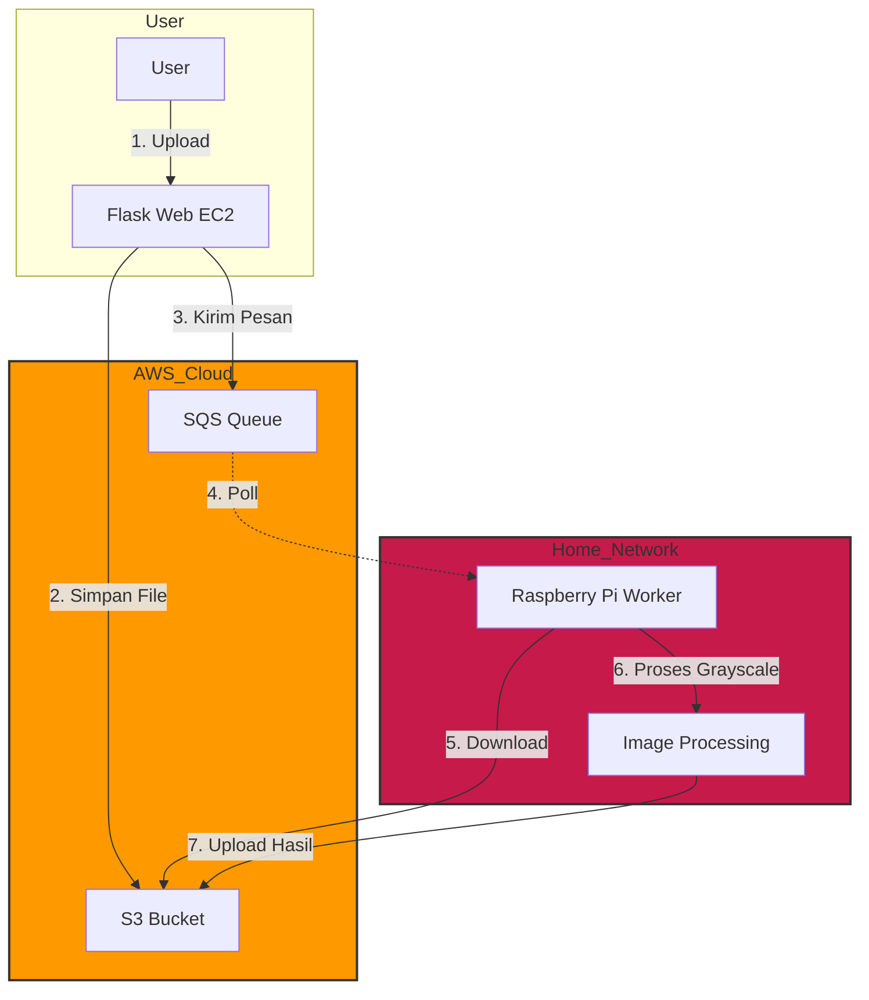
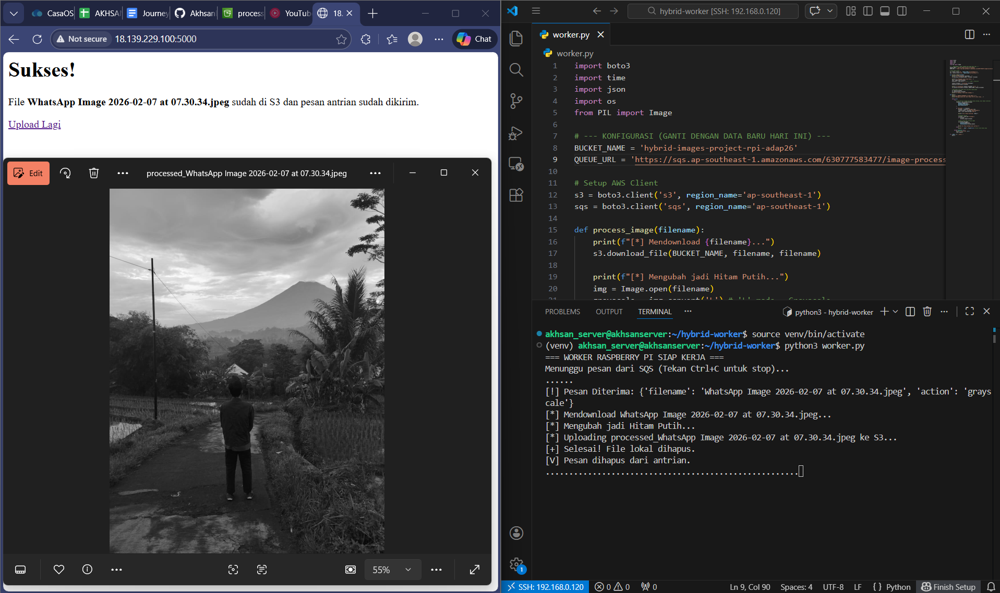

# ☁️ AWS Hybrid Cloud Image Processor


Sebuah sistem pemrosesan gambar **Hybrid Cloud** yang mendemonstrasikan arsitektur *event-driven*. Proyek ini menghubungkan **AWS Cloud (EC2)** sebagai frontend server dengan **Edge Device (Raspberry Pi)** sebagai worker pemrosesan gambar, menggunakan **S3** untuk penyimpanan dan **SQS** untuk manajemen antrian pesan.

---

## 🏗️ Arsitektur Sistem


Alur kerja sistem:
1.  **User** mengupload gambar melalui Web Interface (Flask) yang berjalan di **AWS EC2**.
2.  Gambar disimpan ke **AWS S3 Bucket**.
3.  Metadata gambar dikirim sebagai pesan ke **AWS SQS**.
4.  **Raspberry Pi (Worker)** yang berada di jaringan lokal (Edge) mendeteksi pesan di SQS.
5.  Worker mendownload gambar, memprosesnya (Grayscale), dan mengupload kembali ke S3.



---

## 🚀 Fitur Utama

* **Infrastructure as Code (IaC):** Menggunakan **Terraform** untuk provisioning otomatis resource AWS (EC2, S3, SQS, Security Groups).
* **Automated Provisioning:** Menggunakan Terraform `user_data` untuk instalasi otomatis Docker & Docker Compose saat EC2 booting.
* **Containerization:** Seluruh aplikasi (Web & Worker) dibungkus menggunakan **Docker** dan diorkestrasi dengan **Docker Compose**.
* **Hybrid Connectivity:** Menghubungkan Cloud Public (AWS) dengan Private Network/Home Network (Raspberry Pi) secara aman tanpa mengekspos IP publik worker.
* **Scalability:** Menggunakan SQS memungkinkan kita menambah jumlah worker (Raspberry Pi) kapan saja tanpa mengubah kode server.

---

## 📂 Struktur Folder

```text
.
├── main.tf              # Terraform configuration (EC2, S3, SQS, Security Groups)
├── web-server/          # Kode Frontend Flask (dideploy ke EC2)
│   ├── app.py
│   ├── Dockerfile
│   └── docker-compose.yml
├── edge-worker/         # Kode Worker (dideploy ke Raspberry Pi)
│   ├── worker.py
│   ├── Dockerfile
│   └── docker-compose.yml
└── README.md

## 🛠️ Cara Instalasi & Menjalankan

## Prasyarat

- Akun AWS aktif.
- Terraform terinstall.
- Raspberry Pi (atau komputer lokal lain sebagai worker).
- Docker & Docker Compose.

1. Provisioning Infrastruktur (Terraform)
Masuk ke folder root dan jalankan Terraform untuk membuat infrastruktur AWS:

```bash
terraform init
terraform apply
```
Catat output bucket_name, queue_url, dan public_ip.

2. Konfigurasi Environment Variable
Buat file .env di dalam folder web-server/ DAN edge-worker/ berdasarkan contoh .env.example:

```bash
# .env (Jangan di-commit ke Git)
AWS_ACCESS_KEY_ID=AKIAxxxx
AWS_SECRET_ACCESS_KEY=xxxx
AWS_DEFAULT_REGION=ap-southeast-1
BUCKET_NAME=nama-bucket-dari-terraform
SQS_URL=url-sqs-dari-terraform
```

3. Deploy Web Server (EC2)
SSH ke EC2 (IP didapat dari output Terraform), copy folder web-server, lalu jalankan:

```bash
cd web-server
docker-compose up -d --build
```

4. Deploy Edge Worker (Raspberry Pi)
Di Raspberry Pi, masuk ke folder edge-worker dan jalankan:

```bash
cd edge-worker
docker-compose up -d --build
```

## 📸 Screenshots


*Tampilan web interface, terminal Raspberry Pi worker, dan hasil processing*

---

## 💰 Estimasi Biaya

- **AWS Free Tier**: $0/bulan (t3.micro, S3 5GB, SQS 1 juta pesan/bulan)
- **Setelah Free Tier**: ~$10-15/bulan

---

## 📚 Apa yang Dipelajari

- Menggunakan **managed services** AWS (S3, SQS) dibanding VPS self-managed
- Arsitektur **event-driven** dengan message queue
- **IAM roles** untuk akses AWS (tanpa access key manual di kode)
- **Hybrid cloud**: menghubungkan cloud publik dengan edge device di jaringan lokal
- **Infrastructure as Code** dengan Terraform
