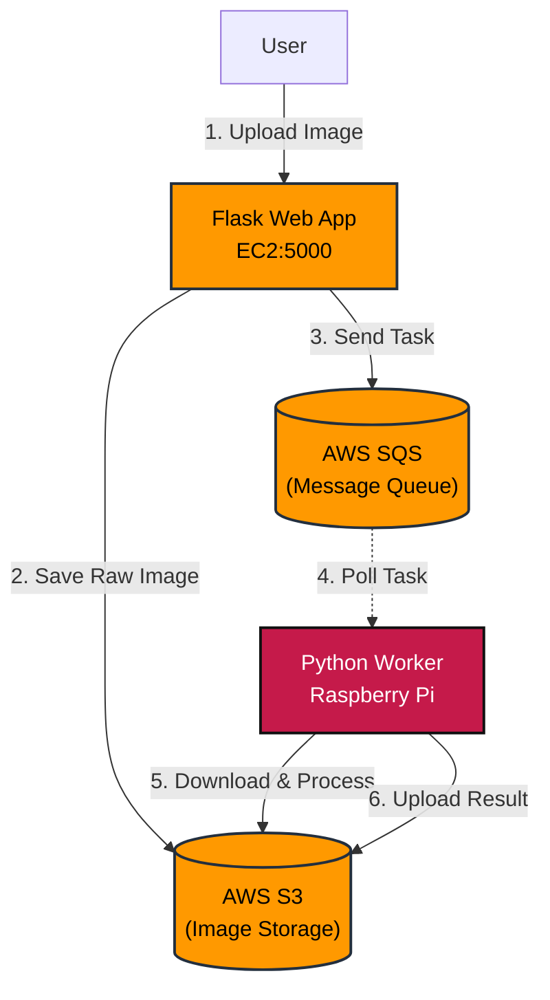
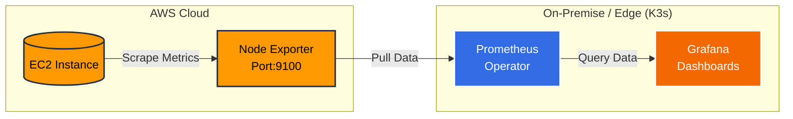
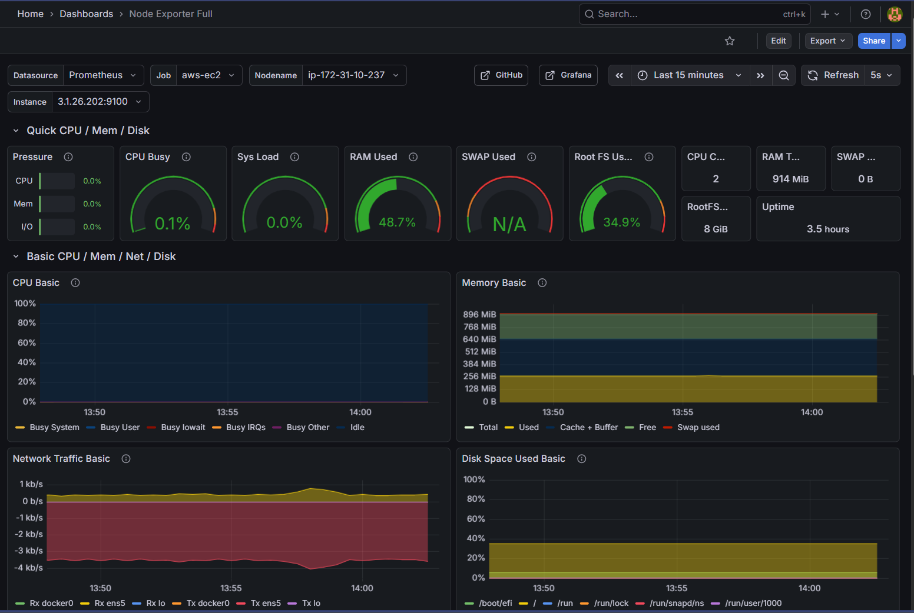
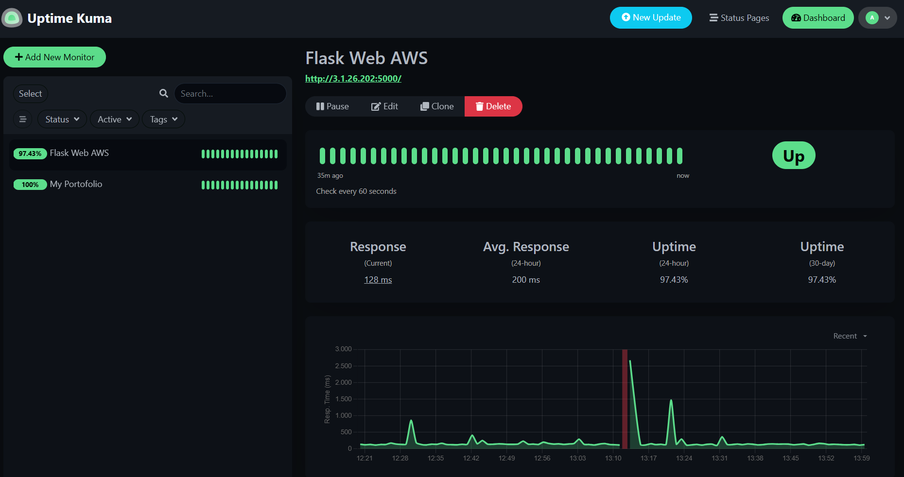
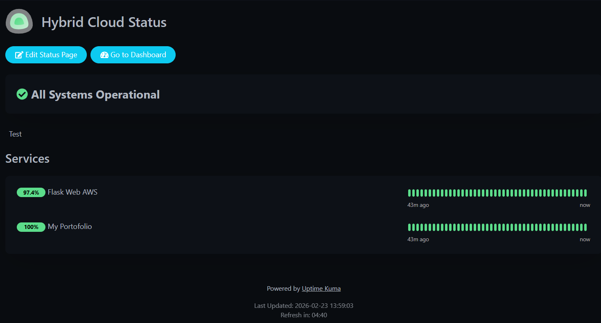

# ☁️ AWS Hybrid Cloud Image Processor


Sebuah sistem pemrosesan gambar **Hybrid Cloud** yang mendemonstrasikan arsitektur *event-driven*. Proyek ini menghubungkan **AWS Cloud (EC2)** sebagai frontend server dengan **Edge Device (Raspberry Pi)** sebagai worker pemrosesan gambar, menggunakan **S3** untuk penyimpanan dan **SQS** untuk manajemen antrian pesan.

---

## 🏗️ Arsitektur Sistem

Sistem ini terdiri dari 3 alur utama yang terpisah namun saling terhubung:

### 1. App Flow (Business Logic)

Alur utama bagaimana gambar diproses:



### 2. Monitoring Flow (Metrics Collection)

Alur bagaimana metrik sistem dikumpulkan dan divisualisasikan:



### 3. Alerting Flow (Notification)

Alur bagaimana sistem mendeteksi masalah dan mengirim notifikasi:

```mermaid
graph LR
    Kuma[Uptime Kuma\nK3s:3001] -->|HTTP Ping (60s)| Flask[Flask Web App\nEC2:5000]
    Flask -.->|Response| Kuma
    Kuma -.->|Webhook Alert| Discord{{Discord\nNotifications}}

    style Kuma fill:#326ce5,stroke:#fff,stroke-width:2px,color:white
    style Flask fill:#FF9900,stroke:#232F3E,stroke-width:2px,color:black
    style Discord fill:#5865F2,stroke:#fff,stroke-width:2px,color:white
```

---

## 🚀 Fitur Utama

### Core Features
- **Infrastructure as Code (IaC):** Menggunakan **Terraform** untuk provisioning otomatis resource AWS (EC2, S3, SQS, Security Groups).
- **Automated Provisioning:** Menggunakan Terraform `user_data` untuk instalasi otomatis Docker & Docker Compose saat EC2 booting.
- **Containerization:** Seluruh aplikasi (Web & Worker) dibungkus menggunakan **Docker** dan diorkestrasi dengan **Docker Compose**.
- **Hybrid Connectivity:** Menghubungkan Cloud Public (AWS) dengan Private Network/Home Network (Raspberry Pi) secara aman tanpa mengekspos IP publik worker.
- **Scalability:** Menggunakan SQS memungkinkan kita menambah jumlah worker (Raspberry Pi) kapan saja tanpa mengubah kode server.

### Monitoring & Alerting
- **Prometheus Operator:** Otomatis scrape metrik dari Node Exporter menggunakan ServiceMonitor.
- **Grafana Dashboards:** Visualisasi metrik sistem secara real-time.
- **Uptime Kuma:** Health check HTTP endpoint dengan notifikasi Discord webhook.

---

## 📂 Struktur Folder

```text
.
├── main.tf                    # Terraform configuration (EC2, S3, SQS, Security Groups)
├── monitoring/                # Konfigurasi monitoring (K3s)
│   ├── kuma-deployment.yaml   # Deployment Uptime Kuma
│   └── monitoring-config.yaml # Konfigurasi Prometheus & Grafana
├── assets/                    # Screenshot & gambar dokumentasi
│   ├── grafana-dashboard.png
│   ├── uptime-kuma-status.png
│   └── uptime-kuma-pages.png
├── web-server/                # Kode Frontend Flask (dideploy ke EC2)
│   ├── app.py
│   ├── Dockerfile
│   └── docker-compose.yml
├── edge-worker/               # Kode Worker (dideploy ke Raspberry Pi)
│   ├── worker.py
│   ├── Dockerfile
│   └── docker-compose.yml
├── screenshots/               # Screenshot demo
└── README.md
```

---

## 🛠️ Cara Instalasi & Menjalankan

### Prasyarat

- Akun AWS aktif.
- Terraform terinstall.
- Raspberry Pi (atau komputer lokal lain sebagai worker).
- Docker & Docker Compose.
- K3s cluster di Raspberry Pi (untuk monitoring).

### 1. Provisioning Infrastruktur (Terraform)

Masuk ke folder root dan jalankan Terraform untuk membuat infrastruktur AWS:

```bash
terraform init
terraform apply
```

Catat output `bucket_name`, `queue_url`, dan `public_ip`.

### 2. Konfigurasi Environment Variable

Buat file `.env` di dalam folder `web-server/` DAN `edge-worker/` berdasarkan contoh `.env.example`:

```bash
# .env (Jangan di-commit ke Git)
AWS_ACCESS_KEY_ID=AKIAxxxx
AWS_SECRET_ACCESS_KEY=xxxx
AWS_DEFAULT_REGION=ap-southeast-1
BUCKET_NAME=nama-bucket-dari-terraform
SQS_URL=url-sqs-dari-terraform
```

### 3. Deploy Web Server (EC2)

SSH ke EC2 (IP didapat dari output Terraform), copy folder web-server, lalu jalankan:

```bash
cd web-server
docker-compose up -d --build
```

### 4. Install Node Exporter (EC2)

Agar Prometheus bisa scrape metrik, install Node Exporter di EC2:

```bash
# Download
wget https://github.com/prometheus/node_exporter/releases/download/v1.6.1/node_exporter-1.6.1.linux-amd64.tar.gz
tar xzf node_exporter-1.6.1.linux-amd64.tar.gz
cd node_exporter-1.6.1.linux-amd64

# Run di background
./node_exporter &
```

Atau tambahkan di docker-compose.yml web-server:

```yaml
services:
  node-exporter:
    image: prom/node-exporter:latest
    ports:
      - "9100:9100"
    command:
      - '--path.procfs=/host/proc'
      - '--path.sysfs=/host/sys'
      - '--collector.filesystem.mount-points-exclude=^/(sys|proc|dev|host|etc)($$|/)'
    restart: unless-stopped
    volumes:
      - /proc:/host/proc:ro
      - /sys:/host/sys:ro
      - /:/rootfs:ro
```

### 5. Deploy Edge Worker (Raspberry Pi)

Di Raspberry Pi, masuk ke folder edge-worker dan jalankan:

```bash
cd edge-worker
docker-compose up -d --build
```

### 6. Deploy Monitoring (K3s)

Pastikan K3s sudah terinstall di Raspberry Pi, lalu deploy monitoring stack:

```bash
# Install Prometheus Operator via Helm
helm repo add prometheus-community https://prometheus-community.github.io/helm-charts
helm install prometheus prometheus-community/kube-prometheus-stack -n monitoring --create-namespace

# Deploy Uptime Kuma
kubectl apply -f monitoring/kuma-deployment.yaml

# Update Prometheus config untuk scrape EC2
kubectl apply -f monitoring/monitoring-config.yaml
```

Akses layanan:
- **Grafana**: `http://<raspberry-pi-ip>:32080` (admin/admin)
- **Uptime Kuma**: `http://<raspberry-pi-ip>:32081`

### 7. Setup Alerting (Discord)

1. Buat Discord Webhook:
   - Server Settings → Integrations → Webhooks → New Webhook
   - Copy webhook URL

2. Configure Uptime Kuma:
   - Buka Uptime Kuma `http://<raspberry-pi-ip>:32081`
   - Tambahkan monitor baru:
     - Type: HTTP(s)
     - URL: `http://<ec2-public-ip>:5000`
     - Heartbeat Interval: 60
   - Setup notification: Discord → Paste webhook URL

---

## 📸 Screenshots

### Grafana Dashboard


### Uptime Kuma Status


### Uptime Kuma Pages


### Demo Application

*Tampilan web interface, terminal Raspberry Pi worker, dan hasil processing*

---

## 📊 Monitoring Metrics

Metric yang tersedia di Grafana:

| Metric | Description | Source |
|--------|-------------|--------|
| CPU Usage | Persentase penggunaan CPU | Node Exporter |
| Memory Usage | Penggunaan RAM | Node Exporter |
| Disk I/O | Read/Write disk | Node Exporter |
| Network Traffic | Inbound/Outbound traffic | Node Exporter |
| Flask Response Time | HTTP response time | Uptime Kuma |
| Image Processing Time | Durasi proses gambar | Worker logs |

---

## 💰 Estimasi Biaya

- **AWS Free Tier**: $0/bulan (t3.micro, S3 5GB, SQS 1 juta pesan/bulan)
- **Setelah Free Tier**: ~$10-15/bulan
- **Raspberry Pi (K3s)**: ~$5-10/bulan (listrik)

---

## 📚 Apa yang Dipelajari

- Menggunakan **managed services** AWS (S3, SQS) dibanding VPS self-managed
- Arsitektur **event-driven** dengan message queue
- **IAM roles** untuk akses AWS (tanpa access key manual di kode)
- **Hybrid cloud**: menghubungkan cloud publik dengan edge device di jaringan lokal
- **Infrastructure as Code** dengan Terraform
- **Container Orchestration** dengan K3s
- **Monitoring & Observability** dengan Prometheus & Grafana
- **Alerting** dengan Uptime Kuma dan Discord webhook
